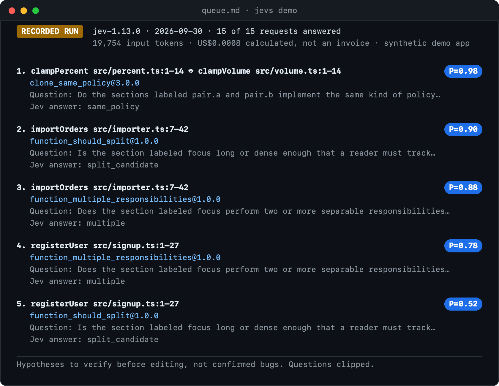

# jev-scanr

[](https://github.com/GabrielCoelhoCruz/jev-scanr/actions/workflows/ci.yml)
[](LICENSE)
[](package.json)


**Find the functions in your TypeScript/JavaScript project most worth refactoring, ranked by the Jev model.** Read-only: it writes a list, never your code.

Jev's whole job here is to answer one narrow question about one function, or one pair of similar ones ("do these two copies implement the same rule?", "does this function do two separable jobs?"), with a probability. jev-scanr asks those questions, sorts the answers and writes a queue for you or your coding agent to verify.

**Measured, one real run** (`jev-1.13.0`, 2026-09-30): 15 requests answered in 3 seconds, 19,754 input tokens, US$0.0008 calculated, on the bundled demo app ([recorded run](examples/demo-app/expected/RECORDED-RUN.md)). The free dry run estimates any project before you spend anything.

## Try it without a key

```sh
npx github:GabrielCoelhoCruz/jev-scanr demo     # replays the recorded run below: no key, no Jev call
```

The command needs no key and calls no API; npx itself downloads the package from GitHub. Use it exactly as written: the package is not on npm yet, and plain `npx jevs` would run an unrelated package, so never run that (details under [Quickstart](#quickstart)). Once installed, the same replay is `jevs demo`.



This is `queue.md` from one recorded run on a demo app we wrote with problems put in on purpose, so it shows the output format, **not accuracy**. Every item is a hypothesis from one Jev answer, not a confirmed bug.

> **Alpha, unofficial** (built on TypeSafe's Jev, not affiliated with TypeSafe). In the one independent test so far, 3 of the 7 original questions were useful often enough to keep on by default; the labels came from an LLM, not a person. [What we measured](#what-we-measured).
>
> On current evidence, free baselines (function length, token coverage) rank the labeled cells of the default signals about as well as Jev's probability does. No difference is statistically clear, and the sample is small and LLM-labeled: [`docs/BASELINE.md`](docs/BASELINE.md).

## How it compares

|                                        | ESLint `complexity` / `max-lines`                                               | `jscpd`                                                                                 | Ask a general LLM to review                                                     | **jev-scanr**                                                                                                                                                                                                                                                                                                                                                                                   |
| -------------------------------------- | ------------------------------------------------------------------------------- | --------------------------------------------------------------------------------------- | ------------------------------------------------------------------------------- | ----------------------------------------------------------------------------------------------------------------------------------------------------------------------------------------------------------------------------------------------------------------------------------------------------------------------------------------------------------------------------------------------- |
| Cost                                   | Free, runs locally                                                              | Free, runs locally                                                                      | Per token: depends on the model and how much code you paste (not measured here) | US$0.0008 measured on the 15-request demo ([recorded](examples/demo-app/expected/RECORDED-RUN.md)); US$0.174 measured for the 1,273 requests of the [validation run](evals/results/validation-gate-2026-09-30.md) on two repositories of about 53,000 lines (older prototype code, same questions); the free dry run estimates yours first (about US$0.016 for this repo's `src/`, an estimate) |
| Reads the whole project                | Every file you give it, one file at a time                                      | Every file you give it, across files                                                    | Only what you paste or the tool loads, within its context window                | Up to 500 files and 12,000 functions per scan, in path order; the dry run lists what it did not read and larger projects go in slices (`--paths`). Each function is judged with bounded context (callers, one hop of imports), not the whole project at once                                                                                                                                    |
| Explains why an item is ranked         | A number against your limit ("complexity 14, limit 10")                         | The duplicated lines and the duplication percentage                                     | Free text, different on each run                                                | In part: each item shows the narrow question, Jev's answer, its probability and the lines to read first. No prose reason, and the probability is not the chance of a bug                                                                                                                                                                                                                        |
| Thresholds can be checked              | You pick the number; the result repeats, but nothing says which number is right | Same: you pick token, line and percent limits                                           | No fixed threshold; answers vary between runs                                   | In part: per-signal hit rates against LLM-reviewer labels are published in [`EVIDENCE.md`](EVIDENCE.md) and the 0.7 cut is a display setting you can move offline (`--threshold`). No person has labeled anything, nothing is calibrated, and probabilities moved by more than 0.05 on 3.8% of repeated cells                                                                                   |
| Edits code                             | No autofix for these rules                                                      | No                                                                                      | Depends on the tool; a chat only suggests                                       | Never: it writes `queue.md`, `report.md` and `report.json` outside your project by default                                                                                                                                                                                                                                                                                                      |
| Measured head to head on the same code | Not run                                                                         | Not run (a jscpd-style token-coverage score was measured, see the note below the table) | Not run                                                                         | AUC 0.71 (`function_should_split`), 0.70 (`function_multiple_responsibilities`), 0.70 (`clone_same_policy`), on 95 LLM-labeled cells. Function length scored 0.88 and 0.80 on the first two, and token coverage 0.73 on `clone_same_policy`. No pooled difference is statistically clear ([`docs/BASELINE.md`](docs/BASELINE.md))                                                               |

The other columns describe how each approach generally works; we did not run them against jev-scanr on the same code. The last row holds the one measurement we have, which is not a run of those tools: Jev's probability against our own re-implementations of a length score and a token-coverage score, computed on the cells an LLM reviewer labeled (n = 95, two samples, the labeled cells were chosen by Jev's P, so this is not a neutral test). The table compares what each one does, not how often it is right, and it claims no advantage in accuracy. When the cheaper tools are the better choice, [say so](#when-to-use-something-else).

**Jev owns the probabilities; your code owns the policy.** Code decides which functions and similar pairs are asked about (pairs need similar token sequences, or, from a second capped source, the same outside names, literals and shape under a rewrite; `name_vs_behavior` asks only functions whose name words are absent from the body; a scan reads at most 500 files; see [`docs/RETRIEVAL.md`](docs/RETRIEVAL.md)) and gathers their context. Whether an item is listed, and where it sits in the order, comes from Jev's answers alone; which questions are asked (`--signals`), where the display cut sits (`--threshold`) and what to do with an item (verify it first, often change nothing) stay with you and your agent. [`docs/architecture.md`](docs/architecture.md) has the pipeline.

## Quickstart

```sh
npm install -g github:GabrielCoelhoCruz/jev-scanr#v0.4.0-alpha   # not on npm yet; needs Node.js 24+
jevs auth                                                        # saves your TypeSafe key, or: export TYPESAFE_API_KEY=...
jevs scan .                                                      # dry run: units, requests, cost estimate; sends nothing
```

The dry run needs no key, so the first and third commands work before you have one. `jevs` is short for `jev-scanr`. A live run needs your own [TypeSafe](https://docs.typesafe.ai) API key and starts only when you add `--run --yes --cap-usd N`.

**Until the package is published to npm, do not run `npx jev-scanr` or `npx jevs`:** npx would fetch whatever package owns that name on npm, which is not this project. Run it without installing with `npx github:GabrielCoelhoCruz/jev-scanr scan .`, or install as above and use the `jevs` and `jev-scanr` commands. (`jr` was this project's short alias before 0.3.0-alpha; it is an unrelated package on npm, so never run `npx jr`.)

_Renamed from `jev-refactor` in 0.3.0-alpha: the old GitHub URL redirects, the commands are now `jev-scanr` and `jevs`, and `jevs auth` moves an existing `jev-refactor` key to the new config directory._

## Use it with a coding agent

The CLI is for people; a coding agent needs the bundled [skill](skills/jev-scanr/SKILL.md) to know when and how to call it. The skill tells the agent to dry-run first, to get your cost cap before any paid run, never to ask for your key in chat, and to check every queue item against the code before changing anything, because items are hypotheses and not orders.

```sh
jevs skill            # run it in the project your agent works on; add --global for a user-wide install
```

`jevs skill` shells out to the [skills CLI](https://github.com/vercel-labs/skills) at a fixed version (1.7.0) and installs the skill from this release's git tag, so the skill text always matches the installed CLI. It needs npm and network access, and it asks which agents to install for unless you pass `--yes`. The equivalent direct command is:

```sh
npx skills@1.7.0 add https://github.com/GabrielCoelhoCruz/jev-scanr/tree/v0.4.0-alpha/skills/jev-scanr
```

Updating the CLI does not touch skills you already installed; run `jevs skill` again after an upgrade.

## Try it

```sh
jevs scan .                                    # dry run: units, requests, coverage, estimated and worst-case cost
jevs scan . --list-files                       # files asked about, files sent only as context, and files skipped and why
jevs scan . --exclude private,legacy/keys --run --yes --cap-usd 0.5    # live run
```

The dry run prints where the report would go: a folder under `~/.cache/jev-scanr` named after the project and plan, never inside the project. Pass `--out DIR` to choose another folder outside the project. Running the same plan again resumes an interrupted run in the same folder.

A live run writes `queue.md` (start here), `report.md` (counts, cost, per-signal table) and `report.json`, plus `plan.json` and the run journal. `plan.json` contains source excerpts, so keep it private. If a run stops early (an API error or the cost cap), the report covers what was answered and `jevs continue` plans only what is missing (`jevs --help`).

**A scan reads at most 500 files, in path order, and indexes at most 12,000 functions and packs at most 2,000 units.** The dry run shows this next to the cost (for example `Coverage: read 485 of 3,953 source files (12%)`), lists the directories it did not read, and warns with `NOT INDEXED` or `NOT PACKED` when a cap cut a slice short. For a larger project, scan it in slices: `jevs scan . --paths apps/web/src/components,apps/server`. Units and their context come only from the paths you give, so keep related code together. Each slice is a separate run with its own cost. If your `tsconfig.json` extends a config that lives in a package (Expo, Next and so on), read [`docs/EXTERNAL-CONFIGS.md`](docs/EXTERNAL-CONFIGS.md) first.

The bundled demo app has problems put in on purpose ([`examples/demo-app/`](examples/demo-app/)), so you can see the output without your own code. `jevs demo` replays the recorded queue with no key and no network. To see what a dry run prints for it:

```sh
jevs scan examples/demo-app
```

```
Units: 14 functions, 1 similar pair
Requests: 15 (29 questions, 0.05 MB of request text)
Estimated cost: US$0.0007 (bytes ÷ 3 per token); worst case US$0.0050 (one token per byte, plus one reservation)
```

Here is an item from a **real run recorded on `jev-1.13.0`** with the three default signals: 15 of 15 requests answered, US$0.0008 ([`expected/`](examples/demo-app/expected/) has the receipt, journal and reports). `queue.md` lists paths, line ranges and Jev's answer, and no source:

```
## 1. clampPercent src/percent.ts:1–14 ↔ clampVolume src/volume.ts:1–14 · clone_same_policy@3.0.0 · P=0.98
- Question: Do the sections labeled pair.a and pair.b implement the same kind of policy or operation…
- Jev answer: same_policy.
- Read first: src/percent.ts:1–14; src/volume.ts:1–14.
```

The two functions clamp a number to a range (0 to 100 and 0 to 10), send NaN to the lowest value, and round. Whether merging them is a good idea is for you to decide; the item only says they look like the same rule written twice. Five questions in the demo were seeded on purpose. The recording put four of them over the cut and **missed one** (`registerUser` for `function_should_split`, at 0.52), and none of the clean functions reached the cut. That shows the output format, **not accuracy**: we wrote the problems, so they are easy. Your run will not match the recording exactly, because Jev's probabilities change from call to call.

## Signals

Three signals are on by default, and in this alpha "default" means only that: under the written gate in [`EVIDENCE.md`](EVIDENCE.md) every signal is still experimental, because no person has labeled anything. `function_multiple_responsibilities` also reached its 8 reviewed items in one repository, while the gate asks for two. One more signal, `name_vs_behavior` (does the function's name describe what its body does?), is opt-in: `--signals name_vs_behavior` asks it, only about functions whose name words are absent from the body ([`docs/RETRIEVAL.md`](docs/RETRIEVAL.md)). It has no reviewed real-code sample. Its one piece of evidence is the constructed contrast: Jev ranked 50 functions renamed to another function's name above the same 50 untouched (AUC 0.97, 0.94 to 0.99), which shows Jev registers a planted mismatch and not how often real names are wrong. The other experimental signals are asked with `--experimental` (all of them, except the opt-in one) or `--signals a,b` (exactly those). The other fourteen questions tried in the prototype were dropped: [`signals/retired.md`](signals/retired.md) says why, with the numbers.

The first numeric column is the independent test: a random sample of above-cut items from two repositories the questions were never tuned on. The second is the dev run on the author's own app, which took the highest-probability items and is therefore an upper bound. Both count items an LLM reviewer judged worth a closer look; no person has labeled any of them.

| Signal                               | Asks about                                                       | Status                        | Independent test | Dev run |
| ------------------------------------ | ---------------------------------------------------------------- | ----------------------------- | ---------------- | ------- |
| `clone_same_policy`                  | a similar pair: do both implement the same rule?                 | default (experimental, alpha) | 12/16            | 5/5     |
| `function_should_split`              | is one function long and dense, with cohesive blocks to extract? | default (experimental, alpha) | 6/16             | 4/5     |
| `function_multiple_responsibilities` | two or more separable jobs in one function                       | default (experimental, alpha) | 3/8              | 2/4     |
| `internal_duplication`               | near-identical blocks inside one function                        | experimental                  | 4/16             | 3/5     |
| `magic_policy_literal`               | unexplained numbers or strings that encode policy                | experimental                  | 3/16             | 3/5     |
| `unused_local_or_parameter`          | a local or parameter that is never read                          | experimental                  | 1/9              | 2/3     |
| `deep_nesting`                       | control flow nested three or more levels                         | experimental                  | no items         | 2/2     |
| `unreachable_code`                   | statements that can never run                                    | experimental                  | no items         | 1/1     |

The rule for going default was written before the test: at least 8 reviewed items and at least 30% worth a look (above 50% for the plain "default" band; 30-50% carries a low-precision warning). `jevs signals` prints the same numbers. Each question lives in one file under [`signals/`](signals/); adding one is described in [`CONTRIBUTING.md`](CONTRIBUTING.md).

P is Jev's probability for the positive option of one narrow question, rounded to two decimals. It is not the chance of a bug or of a refactor paying off, and it changes from call to call. The display cut (0.7, or 0.5 for `function_should_split`) is a display setting (`--threshold` moves every signal at scan time, `--cut-signal ID=N` one of them, `jevs rescore` afterwards). When the chosen option is within 0.01 of another, the item is flagged `near tie`.

## Bands and re-cutting a run

`queue.md` has three parts instead of one hard cut: **worth a look** (P at or above the signal's cut, 0.7 unless the signal has its own default), **uncertain, check** (from the signal's floor, 0.5 unless it has its own, up to the cut) and **below the band**, which is listed only in `report.json`. The cut is per signal (`function_should_split` and `name_vs_behavior` default to 0.5, the rest to 0.7; see [`docs/CUTS.md`](docs/CUTS.md) for how they were chosen and how weak that is). In the recorded demo, `registerUser` for `function_should_split` (P = 0.52) is over that signal's 0.5 cut, and under the old flat 0.7 it was "uncertain". Jev's P moves from call to call, so a cell just under a cut may be just over it next time; the middle band keeps it in view without ranking it with the first list.

`jevs rescore RUN --cut 0.6` re-bands a finished run from its stored answers: no API call, no key. It writes a new `rescored-…/queue.md` next to the old one and never overwrites. Where the edges come from, what `report.json` gained and the options are in [`docs/BANDS.md`](docs/BANDS.md).

**Try rescore on the demo, free and offline.** The package ships the recorded demo run with its `plan.json`. From a clone of this repository: `jevs rescore examples/demo-app/expected --cut 0.6 --out /tmp/demo-rescored` (the 0.52 item moves from "worth a look" to "uncertain"). Installed or through npx, `jevs demo` ends with the same command for the folder it uses.

Does Jev's P rank better than free heuristics? On the labeled cells we have, no evidence that it does: function length ranked `function_should_split` and `function_multiple_responsibilities` at least as well, and token coverage did the same for `clone_same_policy`. The sample is 95 cells with LLM labels, so this is weak in both directions. [`docs/BASELINE.md`](docs/BASELINE.md) has the numbers, the intervals and what they do not show.

## When to use something else

Unused variables, nesting depth and unreachable code are better caught by `tsc` and ESLint (`no-unused-vars`, `max-depth`, `no-unreachable`), locally and for free, and those three signals did worst in our test. For copy-paste detection alone, use `jscpd`. Use `jevs` for the questions those tools cannot ask: whether two similar functions encode the same rule, whether one function mixes separable jobs.

## What we measured

We started with 22 candidate questions and kept the 7 that survived a review rule written before the labels. We then tested those 7 on two public repositories we had never scanned, with the sampling and the pass/fail rule fixed in advance. Three of them reached a default band (one above 50% worth a look, two between 30% and 50%), so those three are now the defaults. The repositories disagreed on two of the three, every label came from an LLM reviewer, and no person has confirmed any of it, so treat this as an alpha. One candidate from a separate showcase on two other public repositories (two similar finalization paths in `oh-my-pi`) led to a bug reproduced with a regression test and an open pull request, [can1357/oh-my-pi#13847](https://github.com/can1357/oh-my-pi/pull/13847). It is **open and not merged**, and the maintainer has not confirmed it. The other showcase candidates remain hypotheses.

[`EVIDENCE.md`](EVIDENCE.md) is the index, with a short glossary of the terms used. Each write-up in [`evals/results/`](evals/results/) gives the method, the sample and what it does not show:

- **[Signal curation on one app](evals/results/signal-curation-daily-tracker.md).** 22 questions in, 7 kept. On the top items of the kept signals 21 of 29 were worth a look (72%, an upper bound), against 1 of 41 for the rest, and 0 of 64 random items below the cut. One project, the author's own.
- **[Validation on two new repositories](evals/results/validation-gate-2026-09-30.md).** Random sample, pre-registered rule. The prototype the release derives from ran it, with the same questions.
- **[Showcase on t3code and oh-my-pi](evals/results/showcase-t3code-oh-my-pi-2026-09-30.md).** Five candidates as hypotheses, on 2.8% to 6.8% of two repositories, with pinned commits.
- **[One candidate, in detail](evals/results/daily-tracker-case-study.md).** What a useful item looks like, and what it takes to confirm one.

## Privacy and cost

- **What is sent:** each analyzed function or pair, with bounded context (callers, imported declarations, one hop), to `https://api.typesafe.ai` under your own key. Nothing else. A dry run sends nothing.
- **What is never read:** `node_modules`, dot-directories, build output, generated files, symlinks, and anything you pass to `--exclude`. Files whose path contains `secret` or `credential`, or whose content looks like a key, token, JWT, private key or a URL with a password in it, are skipped. That guard is a heuristic, so check `--list-files` and choose a root you are willing to send.
- **Your key:** `TYPESAFE_API_KEY` in the environment wins. Otherwise `jevs auth` keeps it in an owner-only file (`$XDG_CONFIG_HOME/jev-scanr/credentials.json`, default `~/.config/jev-scanr/`, mode 0600; a file other users can read is refused). The key is never accepted as a command-line option, printed, or written into a report. `jevs auth --remove` deletes it.
- **Cost:** `jev-1.13.0` at US$0.042 per million input tokens. The dry run prints a central estimate and a worst case. `--cap-usd` refuses to start if the worst case exceeds the cap, and a run stops before any request that could pass it. Up to 8 requests run at once (`--concurrency`), paced under Jev's documented rate limits. There are no automatic retries, and the first error stops the run, a 429 included. Costs are calculated from the tariff and the token counts the API returns; they are not an invoice.
- **Local files:** only what you ask for, in the output folder. Nothing runs your project's code.

See [`SECURITY.md`](SECURITY.md) for the full list and how to report a problem.

## Development

```sh
git clone https://github.com/GabrielCoelhoCruz/jev-scanr && cd jev-scanr
npm ci                                                   # Node.js 24+
npm run ci                                               # syntax and formatting checks, then all tests (offline)
python3 -m unittest discover -s test -p test_pinned_config.py
node src/cli.mjs scan examples/demo-app                  # the same CLI without installing it
```

Tests never call Jev and never need a key. How the pipeline works is in [`docs/architecture.md`](docs/architecture.md), and the evaluation tools are in [`evals/README.md`](evals/README.md). Contributions are welcome, especially new questions with evidence and labels from your own project: read [`CONTRIBUTING.md`](CONTRIBUTING.md), including the rule a signal must pass to be on by default. Releases are described in [`docs/RELEASING.md`](docs/RELEASING.md); the package is not published to npm.

## Related

- [jevgrep](https://github.com/dzhng/jevgrep): Jev-based code search for coding agents. The `auth` and `skill` commands here were inspired by it.

[MIT](LICENSE). Provenance and third-party notices: [`NOTICE.md`](NOTICE.md).
